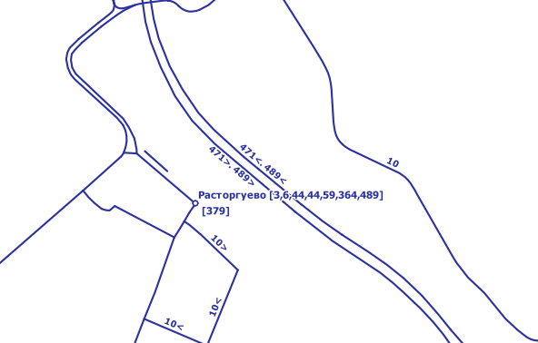
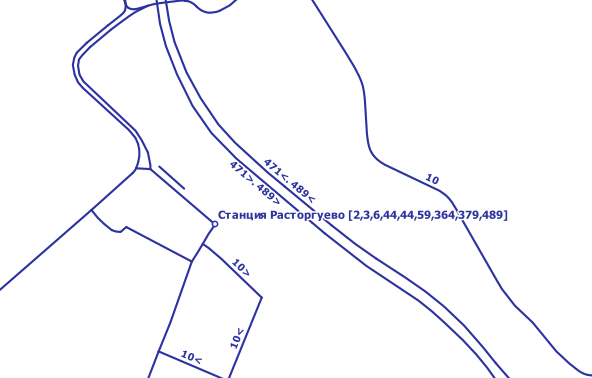
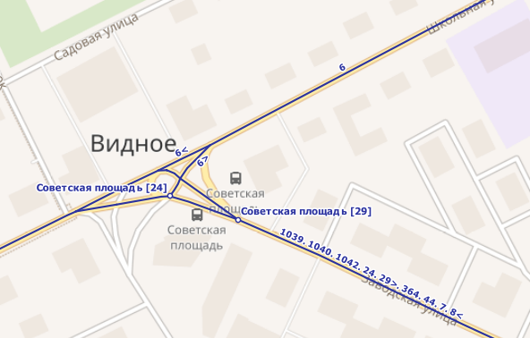
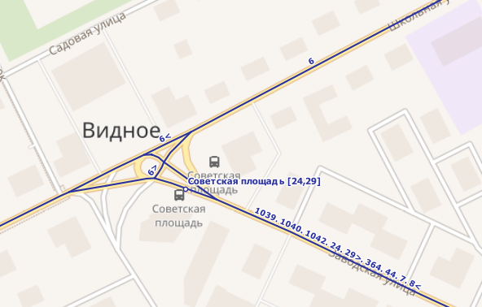

# OSMOT

Script for processing OpenStreetMap data for generate a public transit map.

## Getting Started

These instructions will get you a copy of the project up and running on your local machine for development and testing purposes. See deployment for notes on how to deploy the project on a live system.

### Prerequisites

What things you need to install the software
1. PostGIS 
2. osm2pgsql
3. python


### Installing


```
git clone https://github.com/trolleway/osmot.git
cd osmot
pip install -r requirements.txt
```


## Usage

0. Create PostGIS database
```
createdb gis
psql -U username -d gis -c "CREATE EXTENSION postgis;"
```

1. Prepare osm or pbf file with only needed routes.

Example query for http://overpass-query.eu
```
[out:xml][timeout:25];
(
  relation["route"="bus"]["ref"!="991"]["ref"!="804"]["ref"!="833"]["ref"!="349"]["ref"!="601"](55.5396,37.6666,55.5608,37.7576);
);
out body;
>;
out meta qt;
```

2. Import osm dump to PostGIS database
```
osm2pgsql --create --slim --latlon --style d:\GIS\GIS\soft\default.style --database gis c:\Users\trolleway\Downloads\export.osm
```

* --create - performs DROP CASCADE in database
* --slim - save relation data
* --latlon - store data in EPSG:4326. Optional
* --style - need only at Windows

3.
```
python osmot.py --user trolleway
```

Commandline attributes:
```
usage: osmot.py [-h] [--host HOST] [--database DATABASE] [--username USERNAME]
                [--password PASSWORD] [--reverse]

optional arguments:
  -h, --help           show this help message and exit
  --host HOST          Postgresql host (default: localhost)
  --database DATABASE  Postgresql database (default: gis)
  --username USERNAME  Postgresql username (default: gis)
  --password PASSWORD  Postgresql password (default: )
  --reverse            reverse routes (default: False)
```

4. Connect to PostGIS database in QGIS, add to map new tables: routes_with_refs and terminals_export
5. Load qml styles from /styles/qml


## Terminals generalisation







